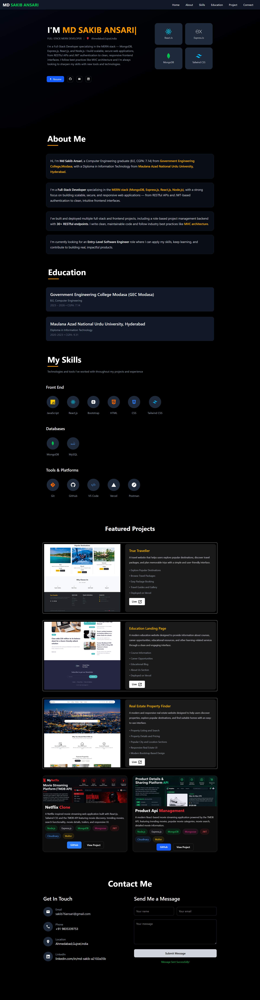

# 🚀 Personal Portfolio Website

A modern, responsive, and professional personal portfolio website built with **React.js** and **Vite**. The portfolio showcases my skills, education, projects, and contact information as a Full Stack MERN Developer.

## 🌐 Live Demo

🔗 **Portfolio:** [View Live Website](https://personal-portfolio-website-lac-delta.vercel.app/)

---

## 📸 Preview



> Replace `portfolio-preview.png` with your actual portfolio screenshot.

---

## ✨ Features

- 🎨 Modern and clean dark-themed UI
- 📱 Fully responsive design
- 🧑‍💻 Personal introduction / Hero section
- 👨‍🎓 Education section
- 🛠️ Skills and technologies section
- 🚀 Featured projects section
- 🔗 Live project links
- 💼 GitHub project links
- 📩 Contact section
- 🧭 Smooth navigation
- ⚡ Fast development with Vite
- 📂 Component-based React architecture

---

## 🛠️ Technologies Used

### Frontend
- React.js
- JavaScript (ES6+)
- HTML5
- CSS3
- Bootstrap / Tailwind CSS *(remove whichever you don't use)*

### Tools & Platforms
- Vite
- Git
- GitHub
- VS Code
- Vercel


## 📂 Project Structure

```text
Personal_portfolio/
│
├── public/
│
├── src/
│   ├── assets/
│   │   ├── education_landing_page.png
│   │   ├── icons.png
│   │   ├── message.png
│   │   ├── Netflix_Clone.png
│   │   ├── Product_Api.png
│   │   ├── Real_estates.png
│   │   └── Truetravlers.png
│   │
│   ├── Component/
│   │   ├── About.jsx
│   │   ├── Connect.jsx
│   │   ├── Education.jsx
│   │   ├── Footer.jsx
│   │   ├── Hero.jsx
│   │   ├── Navbar.jsx
│   │   ├── Project.jsx
│   │   └── Skill.jsx
│   │
│   ├── App.jsx
│   ├── App.css
│   ├── index.css
│   └── main.jsx
│
├── .gitignore
├── eslint.config.js
├── index.html
├── package.json
├── package-lock.json
├── vite.config.js
└── README.md
